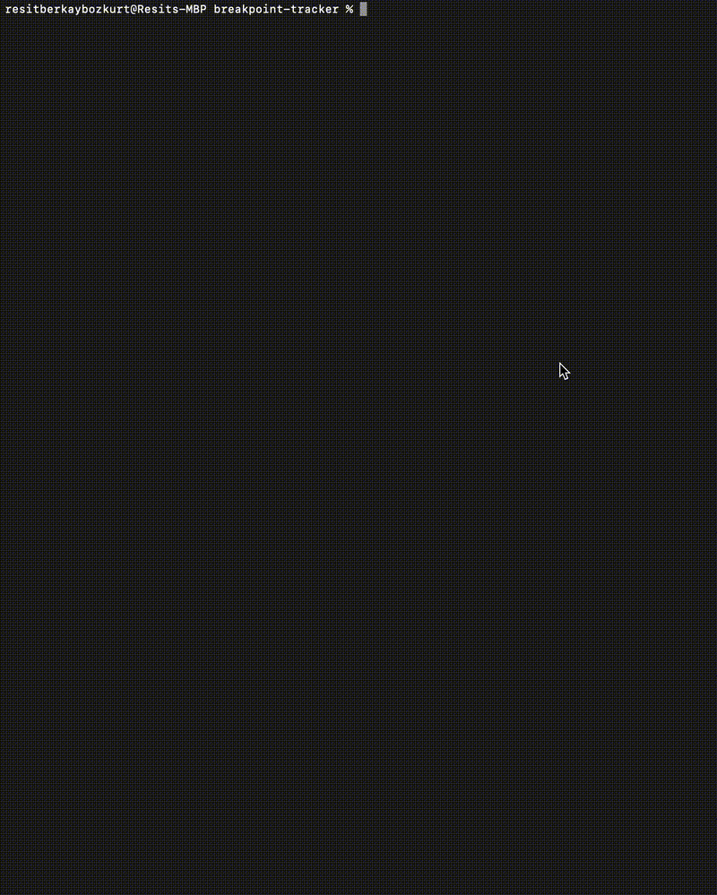

# **Breakpoint Tracker - JetBrains Plugin**

🚀 **Breakpoint Tracker** is a JetBrains IDE plugin that tracks breakpoints in real-time and displays them in a dedicated tool window. It supports both an **internal JCEF renderer** and an **external React frontend** for visualization.

---

## **📌 Features**

✅ **Real-time Breakpoint Tracking** – Automatically detects added, removed, and modified breakpoints.  
✅ **Flexible UI Rendering** – Choose between:
- **Intern Mode**: Uses JetBrains' built-in **JCEF renderer**.
- **Extern Mode**: Uses an **external React frontend** for enhanced UI.  
  ✅ **Seamless JetBrains Integration** – Hooks directly into JetBrains’ **XDebugger**.  
  ✅ **Dynamic UI Updates** – Automatically refreshes the UI upon breakpoint changes.  
  ✅ **Customizable Port Configuration** – Allows setting a custom port for the external frontend.

---

## **📂 Project Structure**

```
📦 breakpoint-tracker
├── assets/
├── 📂 frontend/                   # External React frontend (optional)
├── 📂 src/                        # JetBrains plugin core
│   ├── main/kotlin/com/rbbozkurt/breakpointtracker
│   │   ├── ui/                    # UI components (JCEF)
│   │   ├── service/               # Breakpoint tracking logic
│   │   ├── util/                  # Utility functions
│   ├── resources/META-INF
├── run_plugin.sh                   # Script to build & run plugin with UI options
├── README.md                       # Documentation
```

---

## **🛠️ Setup & Installation**

### **🔴 Prerequisites**

Before running the plugin, ensure you have the following installed:
- **JetBrains IDE** (IntelliJ IDEA, PyCharm, WebStorm, etc.)
- **Java 17+**
- **Gradle** *(if not installed globally, the script will use `./gradlew`)*
- **Node.js & npm** *(if using the external frontend)*
- **lsof** (to check for active ports)

---

### **🚀 Running the Plugin**

Clone the repository:
```bash
git clone https://github.com/rbbozkurt/breakpoint-tracker.git
cd breakpoint-tracker
```

Run the setup script:
```bash
chmod +x run_plugin.sh
./run_plugin.sh
```

You will be prompted to choose:

1️⃣ **Intern Mode** – Uses JetBrains' built-in JCEF Renderer (no external server).

2️⃣ **Extern Mode** – Uses an external React frontend. *(You will be asked to enter a port.)*

> **Example Run for Extern Mode:**
> - Choose **2 (extern)**
> - Enter port **5178** *(or press Enter to use default: 5173)*
> - The script will start the frontend & plugin.

---

## 🎬 Demo
###  🖥️ Intern Mode (JCEF Renderer)  
  


###  🌐 Extern Mode (React Frontend)  
  
###

## **🖥️ Development**

### **Frontend Development**
If you are modifying the **React frontend**, start it manually:
```bash
cd frontend
npm install   # Run this only once
npm run dev -- --port=5173
```
The frontend will run at **http://localhost:5173** *(or your chosen port).*

### **Plugin Development**
To make changes to the plugin:
- Modify files under `plugin/src/main/java/com/rbbozkurt/breakpointtracker/`.
- Run the plugin using:
  ```bash
  ./gradlew runIde -DUI_ENV=intern
  ```

---

## **🛠️ Configuration**

| Environment Variable  | Description                                  | Default Value  |
|----------------------|----------------------------------------------|---------------|
| `UI_ENV`            | Defines rendering mode: `intern` or `extern` | `intern`      |
| `UI_PORT`           | Port number for external frontend            | `5173`        |

> **Example: Run Plugin with External UI on Custom Port**
> ```bash
> ./gradlew runIde -DUI_ENV=extern -DUI_PORT=5178
> ```

---

## **📧 Contact**

👤 **R. Berkay Bozkurt**  
📧 Email: resitberkaybozkurt@gmail.com  
📂 GitHub: [github.com/rbbozkurt](https://github.com/rbbozkurt)

---

